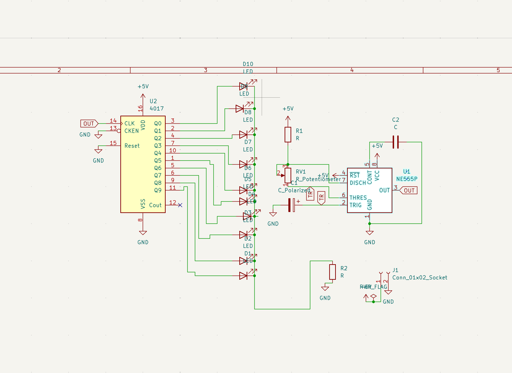
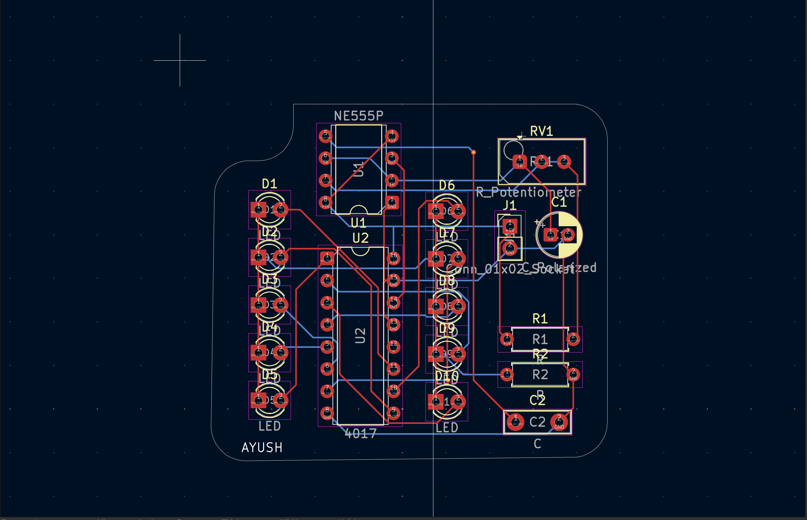
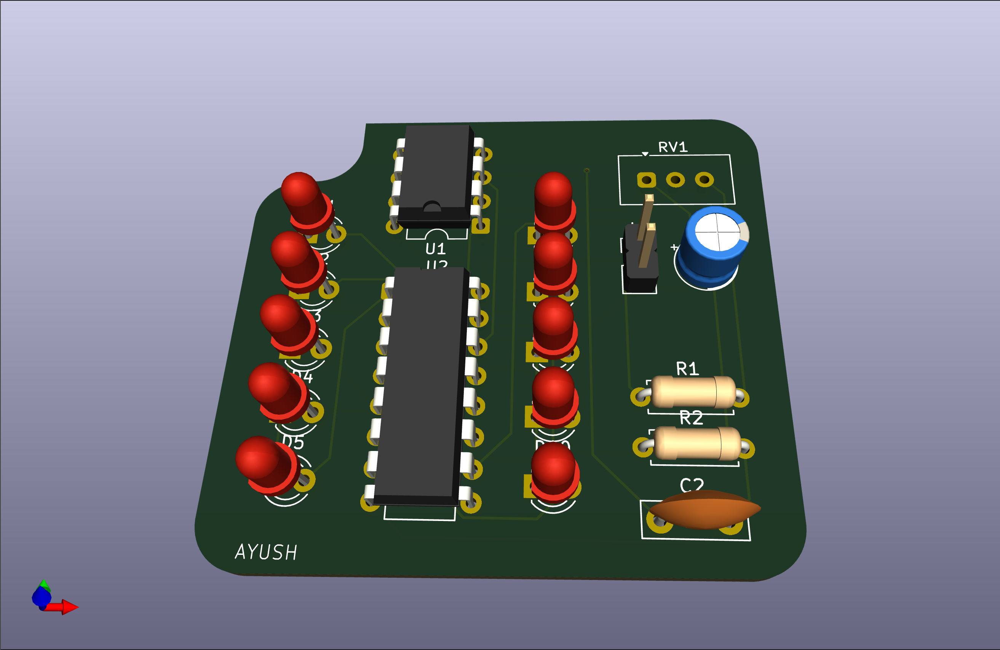

# Blinky Board 

LED chase ("blinky") circuit created for beginners in **Stasis**.

## Components

**NE555 timer** as a pulse generator
**CD4017 decade counter** to control outputs
Several LEDs as indicators

Pulses generated by the 555 timer trigger the 4017, which switches LEDs to form a running light.

## Advantages

Speed control using potentiometer
Easy and newbie-friendly design
Use of popular parts
Perfect for digital & analog electronics basics education

## Folder Structure

```
.
├── bom.csv              # Bill of materials
├── grb 2.zip            # Gerber files for PCB manufacturing
├── image/
│   ├── schematic.png    # Circuit diagram
│   ├── pcb.png          # PCB layout
│   └── 3d.png           # 3D view
├── kicad/
│   ├── StarLight.kicad_sch
│   ├── StarLight.kicad_pcb
│   └── StarLight.kicad_pro
└── README.md
```

## How it works

1. The **NE555** chip functions in astable configuration to produce clock pulses.
2. Clock pulses are fed into the **CD4017** counter.
3. The counter shifts from one output to another.
4. Outputs activate LEDs to produce the chaser effect.

## Quick start guide

1. Load the project in **KiCad**
2. Examine the circuit and board diagrams
3. Generate Gerbers (or download ZIP file)
4. Order PCB or assemble on protoboard
5. Install components from `bom.csv`

## Preview

* Schematic: `image/schematic.png`
  
* PCB: `image/pcb.png`
  
* 3D View: `image/3d.png`
  
  

Developed as a basic hardware project
